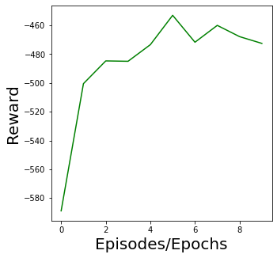

# "Reinforcement Learning-Based Microrobot Navigation Along Circular Paths Using Magnetic Field Control"

---

## 🚀 Features

- ✅ Microrobot environment with magnetic field actuation
- ✅ State, Action, Reward, Next State, Done (MDP)
- ✅ Continuous control with **Soft Actor-Critic (SAC)**
- ✅ Reward shaping to enforce circular trajectory
- ✅ Visual plots of path and performance

---

# 🤖 Microrobot Navigation using Reinforcement Learning (Soft Actor-Critic)

This project explores autonomous microrobot navigation from one point to another along a **circular path**, under the influence of a **controlled magnetic field**, using **Deep Reinforcement Learning**. It applies the **Soft Actor-Critic (SAC)** algorithm in a **continuous control setting** where:

- 📸 The **state space** is image-based, representing the simulation graph (e.g., robot position on the field).
- 🌀 The **action space** controls rotation **around and along the axis** via angle **Φ (phi)**—simulating torque or field orientation.

---

## 📷 Visuals

### 🧭 Circular Navigation Path  

### 📈 Reward Curve over Training  

---

## 🧠 Algorithm: Soft Actor-Critic (SAC)

- Entropy-regularized RL algorithm for stable training
- Continuous action space (perfect for magnetic field control)
- Automatic temperature tuning

